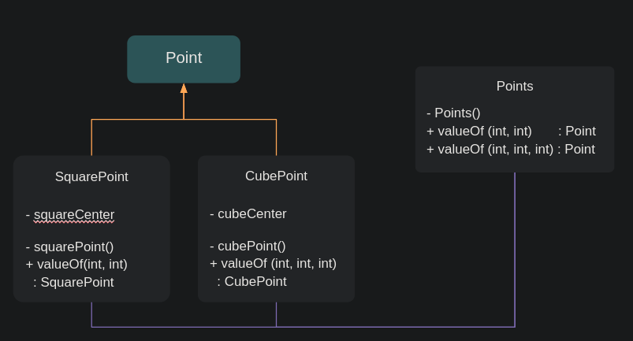

# Effective Java ch2

## Item 1. 생성자 대신 정적 팩터리 메서드를 고려하라

클라이언트가 클래스의 인스턴스를 얻는 방법

- public 생성자
- 정적 팩토리 메서드

> 그냥 public 생성자 쓰면 되는거 아냐? 왜 굳이 팩터리 메서드를 만들어?

1. 메서드 네이밍으로 반환할 객체의 특성을 정확하게 묘사 가능

   ***생성자와 일반 메서드 네이밍 범위 차이 :: 클래스 이름 vs 메서드의 기능을 보이는 자유로운 네이밍***

    - 생성자는 항상 클래스 이름을 오버라이딩해서 사용<br>
      → 매개변수에 따라 반환 받는 객체가 달라짐<br>
      → 클라이언트 측에서 생성자의 파라미터만 보고 어떤 객체가 생성될 지 명확한 예측이 어려움<br>
    - 이에 반해 팩토리 메서드는 생성자와 달리 네이밍이 자유로움.<br>
      매개변수에 따라 반환받을 수 있는 객체의 형상을 메소드 이름에 담을 수 있음<br>
      ex. BigInteger.probablePrime vs BigInteger(int, int, Random)<br><br>

   ***생성자의 한계 :: 시그니처 별 하나의 생성자만 만들 수 있다.***

   **Method Signature**
   메서드 이름과 매개변수 리스트의 조합으로, 매개변수의 타입과 개수가 이에 해당.<br>
   메서드 오버로딩에서 컴파일러가 메서드 간 차이를 식별하는 기준이 됨.

    ```java
    public void funcA(int x, int y){ ... }
    public void funcA(int x, int y, double z){...}
    ```

    - 시그니처가 같은 생성자가 여러개일 수 없어 매개변수의 순서를 달리하는 등의 꼼수 도입<br>
      → 생성자 마다의 역할을 정확히 기억하기 어려움<br>
      → 명세 없이는 엉뚱한 것을 호출할 가능성 농후<br>
    - 이에 반해 팩토리 메서드는 시그니처가 같은 여러 생성자가 필요할 경우,<br>
      생성자를 정적 팩터리 메서드로 바꾸고, 각각의 차이를 명확히 드러내게 네이밍 하면 됨.
2. 호출될 때마다 인스턴스를 새로 생성하지 않아도 된다.
    - Immutable class - 불필요한 객체 생성을 피할 수 있다.<br>
      → 캐싱할 객체를 미리 static 으로 만들어놓고 요청올 때마다 같은 걸 넘겨주면 됨<br>

    ```markdown
     Immutable 불변?
     객체가 생성된 이후 그 상태를 변경할 수 없는 디자인 패턴

     객체는 참조(reference) 형태로 전달하고 전달 받아 객체가 참조를 통해 공유됨
     → “레퍼런스를 참조한 다른 객체에서 객체를 변경”
     → 이를 예방할 수 있는 게 static final 객체를 만들어 caching 하는 것
     컴파일 단계에서 미리 만들어놓는 static + 한번 만들면 only read 만 가능한 final
   
    ```
   *Java > Boolean.class*

       ```java
       public final class Boolean implements Serializable, Comparable<Boolean> {
           public static final Boolean TRUE = new Boolean(true);
           public static final Boolean FALSE = new Boolean(false);
           
               public static Boolean valueOf(boolean b) {
               return b ? TRUE : FALSE;
           }
               ...
       }
       ```

   *Custom Example > SquarePoint.class*

       ```java
       class SquarePoint implements Point {
           private int y = 0; private int x = 0;
           private static final SquarePoint squareCenter = new SquarePoint(0, 0); // 미리 만들어놓고

           public static SquarePoint valueOf(int y, int x) {
               return y == 0 && x == 0 ? squareCenter : new SquarePoint(y, x); // 원점을 원할 때 새로 생성하지 않고 캐싱
           }
            //...
        }
       ```

    - 정적 팩터리 방식의 클래스<br>→ Instance-controlled class 언제 어느 인스턴스를 살아있게 할지 통제할 수 있는 클래스
        - 일반적으로는 클라이언트 쪽에서 new 로 생성하고 객체의 생성과 소멸을 결정 지음<br>
          이 경우, 그 주도권을 서버 클래스 쪽에서 생명주기를 정리하는 것
        - singleton, non-instantiable 클래스로 만들 수 있음.
        - 동치인 인스턴스가 단 하나뿐임 보장 가능.<br><br>
3. 반환 타입의 하위 타입 객체를 반환 가능
    - *Java Example*

      *Collections.class*

        ```java
        public class Collections {
                private Collections() {
            }
                public static <T extends Comparable<? super T>> void sort(List<T> list) {
                list.sort((Comparator)null);
            }
                //...
        }
        ```

      *List.class (interface)*

        ```java
        public interface List<E> extends Collection<E> {
                default void sort(Comparator<? super E> c) { // LinkedList 가 사용
                Object[] a = this.toArray();
                Arrays.sort(a, c);
                ListIterator<E> i = this.listIterator();
                Object[] var4 = a;
                int var5 = a.length;
 
                for(int var6 = 0; var6 < var5; ++var6) {
                    Object e = var4[var6];
                    i.next();
                    i.set(e);
                }
                }
                //...
        }
        ```

      *ArrayList.class*

        ```java
        public class ArrayList<E> extends AbstractList<E> implements List<E>, RandomAccess, Cloneable, Serializable {
                public void sort(Comparator<? super E> c) {
                int expectedModCount = this.modCount;
                Arrays.sort(this.elementData, 0, this.size, c);
                if (this.modCount != expectedModCount) {
                    throw new ConcurrentModificationException();
                } else {
                    ++this.modCount;
                }
            }
                //...
        }
        ```

   Custom Example > Points.class

    ```java
    class Points {
        private Points() {
        }

        public static Point valueOf(int y, int x) {
            return SquarePoint.valueOf(y, x);
        }

        public static Point valueOf(int y, int x, int z) {
            return CubePoint.valueOf(y, x, z);
        }
    }
    ```

   

4. 입력 매개변수에 따라 매번 다른 클래스의 객체 반환 가능
    - 반환타입의 하위 타입이기만 하면 어떤 클래스의 객체를 반환하든 상관 없음.
    - EnumSet 클래스는 public 생성자 없이 원소의 수에 따라 두 가지 하위 클래스 중 하나의 인스턴스 반환

        ```java
        public abstract class EnumSet<E extends Enum<E>> extends AbstractSet<E> implements Cloneable, Serializable {
                public static <E extends Enum<E>> EnumSet<E> noneOf(Class<E> elementType) {
                Enum<?>[] universe = getUniverse(elementType);
                if (universe == null) {
                    throw new ClassCastException(elementType + " not an enum");
                } else {
                    return (EnumSet)(universe.length <= 64 ? new RegularEnumSet(elementType, universe) : new JumboEnumSet(elementType, universe));
                }
            }
                ...
        }
        ```

      원소 개수에 따라 실제로 반환하는 구현형 타입이 달라짐<br>
        - 64개 이하면 원소들을 long 변수 하나로 관리하는 RegularEnumSet 인스턴스
        - 65개 이상이면 long 배열로 관리하는 JumboEnumSet 인스턴스 반환<br><br>

      → 성능 상 두개로 나누었으나, 클라이언트는 이를 모름.<br><br>

5. 정적 팩터리 메서드 작성 시점에는 반환할 객체의 클래스가 존재하지 않아도 된다.

   서비스 제공자 프레임워크

    1. service interface :: 구현체의 동작 정의 ex. JDBC - Connection
    2. provider registration API :: 제공자가 구현체를 등록할 때 사용<br>
       ex. JDBC - DriverManager.registerDriver
    3. ***service access API*** :: 클라이언트가 서비스의 인스턴스를 얻을 때 사용

       조건을 명시하지 않으면 기본 구현체를 반환하거나 지원하는 구현체들을 하나씩 돌아가며 반환<br>
       → flexible static factory  ex. JDBC - DriverManager.getConnection

    4. service provider interface :: 서비스 인터페이스의 인스턴스를 생성하는 팩터리 객체 설명<br>
       ex. JDBC Driver, DI Framework

   > 이렇게 좋은데 그럼 생성자 쓸 필요 없는거 아냐?

    1. 상속 불가 b/c public 이나 protected 생성자 필요

       어찌 보면 이 제약은 상속보다 컴포지션을 사용하도록 유도,<br>
       불변 타입으로 만들려면 이 제약을 지켜야 한다는 점에서 오히려 장점으로 받아들일 수 있음.<br><br>

    2. 프로그래머가 찾기 어려움
    #### Naming Convention of static constructor
   | Name        | Description  | Example  |
      | ------------- |------------- | ----- |
   | from  | 단일 매개변수를 받아 해당 타입의 인스턴스 반환하는 형변환 메서드 | Date d = Date.from(instant); |
   | of   | 여러 매개변수를 받아 적합한 타입의 인스턴스를 반환하는 집계 메서드 | Set<Rank> faceCards = EnumSet.of(JACK, QUEEN, KING); |
   | valueOf|from과 of의 더 자세한 버전|BigInteger prime = BigInter.valueOf(Integer.MAX_VALUE);|
   |instance / getInstance|(매개변수를 받는다면) 매개변수로 명시한 인스턴스를 반환하지만,같은 인스턴스임을 보장하지는 않는다.| Stackwalker luke = StackWalker.getInstance(options); |
   |create / newInstance|instance/getInstance 와 같지만, 매번 새로운 인스턴스를 생성해 반환함을 보장| Object newArray = Array.newInstance(classObject, arrayLen);|
   |getType |getInstance와 같으나, 생성할 클래스가 아닌 다른 클래스에 factory method 정의할 때 씀.<br>* "Type"  팩터리 메서드가 반환할 객체의 타입|FileStore fs = Files.getFileStore(path);|
   |newType|newInstance와 같으나, 생성할 클래스가 아닌 다른 클래스에 팩터리 메서드 정의할 때 쓴다.<br> * "Type" 팩터리 메서드가 반환할 객체의 타입|BufferedReader br = Files.newBufferedReader(path);|
   |type|getType, newType의 간결한 버전|Collections.list(legacyLitany);|